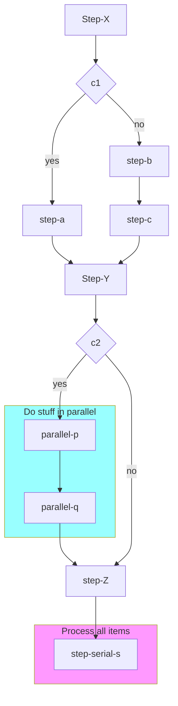

# @oselvar/c4

Oselvar C4 Pulse is a system that generates C4 diagrams and other software architecture diagrams automatically.

It uses several advanced mechanisms to collect information about your systems, how they are composed and how they interact.

The diagrams and model behind them is updated continuously throughout your SDLC.
Data is collected at various stages:

- Manual (beginner) - import mermaid, plantuml or other
- Production (advanced) - wrappers, telemetry, decorators/annotations/attributes
- Test (expert) - scenarios, dynamic diagrams, sequence diagrams

We provide a gradual guide to guide programmers and sysadmins and "devops engineers"
that guides them through every stage. They can adopt Pulse gradually and get incremental value.

The architecture of Pulse is a functional core written in TypeScript. This provides two benefits:

- We can tree-shake the code to reduce bundle sizes
- It makes it easy to provide a plugin API at every stage of the transformation

The structure of a software system is maintained in a graph database...

Generate C4 models from TypeScript source code:

- Context / Container / Component diagrams based on decorators:
  - `@C4SoftwareSystem`
  - `@C4Container`
  - `@C4Component`
  - `@C4Operation`
- Code: Workflow diagrams generated with the `@oselvar/c4` CLI.

## Examples

The examples below are generated from examples in this repo.

### Context / Containers / Components diagrams

First, run the tests:

    npm test

This will write files to `src/examples/workspace/workspace.{dsl,c4}`.

These are [Structurizr](https://structurizr.com/) and [LikeC4](https://likec4.dev) sources.
The Structurird `.dsl` file can be rendered with `structurizr-lite`, but that's a bit cumberome
(requires a docker setup or jvm). Instead we use LikeC4:

    npx likec4 start src/examples/workspace
    npx likec4 export png src/examples/workspace
    npx likec4 codegen d2 src/examples/workspace
    make

### Workflow diagram

Generated with:

    npx @oselvar/c4 workflow --format mermaid src/workflows/cloudflare/examples/SampleWorkflow.ts



## Why

The C4 model is a great way to visualize software systems.

Many teams don't have team members who know how to use the tooling.
If they do, it's always time consuming to keep those models uptodate.

With `@oselvar/c4` you can generate diagrams from code.

Quoting from the [C4 docs](https://c4model.com/diagrams/faq#will-the-diagrams-become-outdated-quickly):

> Automatically generating your diagrams will ensure they are kept up to date and reflect reality at all times.

## Registering C4 Objects

There are several ways to register C4 objects:

- Decorators
- OpenAPI
- Explicitly

### Decorators

Annotate classes with `@C4SoftwareSystem`, `@C4Container`, and `@C4Component` decorators to specify the C4 object type the class represents.

Annotate Component methods with the `@C4Operation` decorator.

StructurizrGen will record the calls made between each component and generate a Structurizr DSL that you can use to visualize the
system.

### OpenAPI

Register OpenAPI specs with the `addOpenApiComponents` method.

Add a Middleware to record calls.

Set the `X-C4-Caller` header to the name of the caller.

## Usage with Vitest

Add a `C4ModelWriter` to `reporters` and configure it with the diagrams you wish to create.
You also need to add `C4ModelWriter.setupFile` to `setupFiles`.

Finally you have to to disable isolates and file parallelism as shown below:

```ts
// vite.config.ts
export default defineConfig({
  test: {
    isolate: false,
    fileParallelism: false,
    setupFiles: [C4ModelWriter.setupFile],
    reporters: [
      "default",
      new C4ModelWriter(
        (c4Model) => ({
          file: "src/examples/system-context-bank.md",
          content: generateC4PlantUml(c4Model, "SystemContext", "Bank"),
        }),
        (c4Model) => ({
          file: "src/examples/container-bank.md",
          content: generateC4PlantUml(c4Model, "Container", "Bank"),
        }),
        (c4Model) => ({
          file: "src/examples/component-api-application.md",
          content: generateC4PlantUml(c4Model, "Component", "APIApplication"),
        }),
      ),
    ],
  },
});
```
