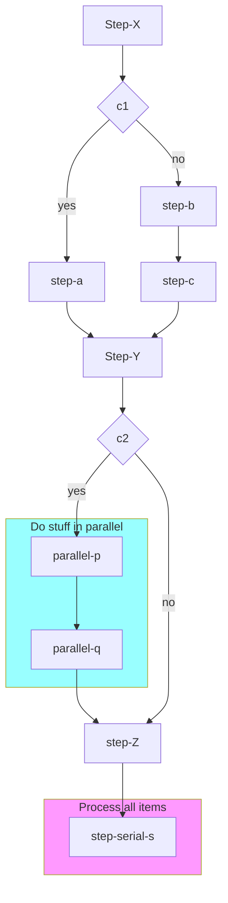

# @oselvar/c4

Generate C4 models from TypeScript source code:

- Context / Container / Component diagrams based on decorators:
  - `@C4System`
  - `@C4Container`
  - `@C4Component`
  - `@C4Operation`
- Code: Workflow diagrams generated with the `@oselvar/c4` CLI.

## Examples

The examples below are generated from examples in this repo.

### Context / Containers / Components diagrams

### Workflow diagram

Generated with:

    npx @oselvar/c4 workflow --format mermaid src/workflows/cloudflare/examples/SampleWorkflow.ts



## Why

The C4 model is a great way to visualize software systems.
The Structurizr DSL is a great way to document a software system and how it
fits into a larger ecosystem.

However, manually maintaining a Structurizr DSL is frought with peril:

- How do we keep it up to date as the code evolves?
- How do we know if we missed something?
- How do we know if the DSL is even correct?

Quoting from the [C4 docs](https://c4model.com/diagrams/faq#will-the-diagrams-become-outdated-quickly):

> Automatically generating your diagrams will ensure they are kept up to date and reflect reality at all times.

StructurizrGen aims to solve these problems by generating the DSL from the
source code and information gathered while the system is running or being tested.

## Registering C4 Objects

There are several ways to register C4 objects:

- Decorators
- OpenAPI
- Explicitly

### Decorators

Annotate classes with `@C4System`, `@C4Container`, and `@C4Component` decorators to specify the C4 object type the class represents.

Annotate Component methods with the `@C4Operation` decorator.

StructurizrGen will record the calls made between each component and generate a Structurizr DSL that you can use to visualize the
system.

### OpenAPI

Register OpenAPI specs with the `registerOpenApiComponents` method.

Add a Middleware to record calls.

Set the `X-StructurizrGen-Caller` header to the name of the caller.

## Usage with Vitest

In order to keep a single instance of the C4Model, we need to disable
parallelism and isolation in `vite.config.ts`. We also need to add a
`setupFiles` option to write the DSL to a file at the end of a test run.

```ts
// vite.config.ts
export default defineConfig({
  test: {
    isolate: false,
    fileParallelism: false,
    setupFiles: ["src/lib/c4/write-structurizr-dsl.ts"],

    // Optional:
    sequence: {
      concurrent: false,
    },
  },
});
```

```ts
// src/lib/c4/write-structurizr-dsl.ts
import { c4Model } from "$lib/structurizrgen/c4Model";

afterAll(async () => {
  const dsl = c4Model.generateStructurizrDSL();
  await writeFile("doc/structurizr/workspace/workspace.dsl", dsl);
});
```
