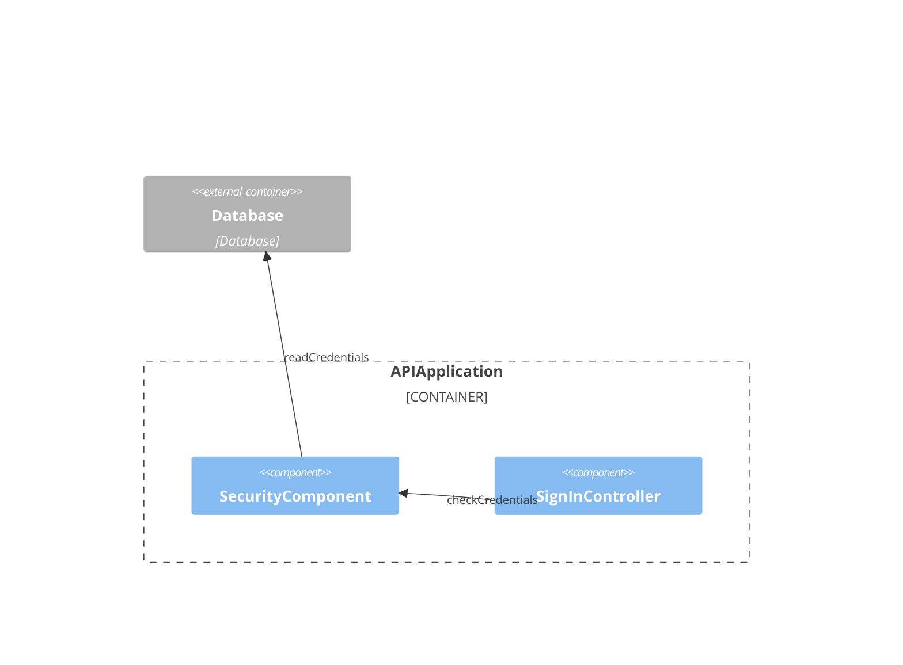

```mermaid
C4Component

Container_Boundary(containerAPIApplication, "APIApplication") {
    Component(componentSecurityComponent, "SecurityComponent")
    Component(componentSignInController, "SignInController")
}
Container_Ext(containerDatabase, "Database", "Database")

Rel(componentSecurityComponent, containerDatabase, "readCredentials")
Rel(componentSignInController, componentSecurityComponent, "checkCredentials")
```
