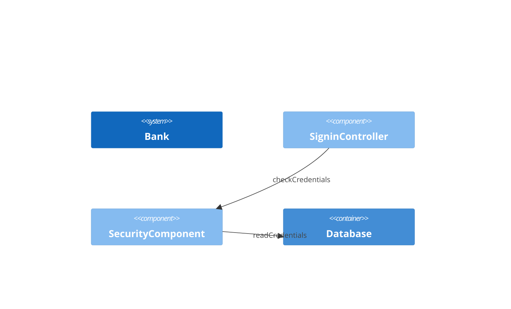

```mermaid
C4Context
  System(systemBank, "Bank", "")
  Component(componentSignInController, "SigninController", "")
  Component(componentSecurityComponent, "SecurityComponent", "")
  Container(containerDatabase, "Database", "")
  Rel(componentSecurityComponent, containerDatabase, "readCredentials", "")
  Rel(componentSignInController, componentSecurityComponent, "checkCredentials", "")
```
