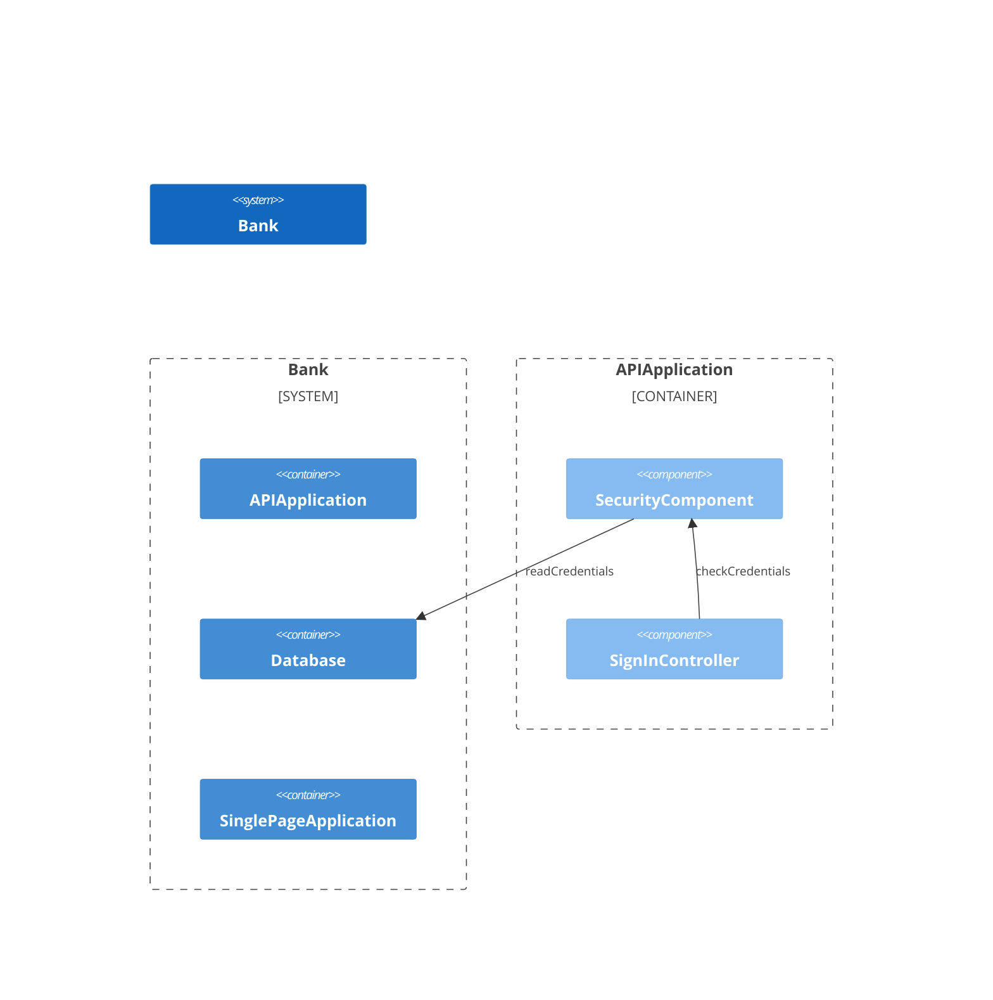

```mermaid
C4Context
  System(systemBank, "Bank", "")
  Container(containerAPIApplication, "APIApplication", "")
  Container(containerDatabase, "Database", "")
  Container(containerSinglePageApplication, "SinglePageApplication", "")
  Component(componentSecurityComponent, "SecurityComponent", "")
  Component(componentSignInController, "SignInController", "")
  Rel(componentSecurityComponent, containerDatabase, "readCredentials")
  Rel(componentSignInController, componentSecurityComponent, "checkCredentials")
  System_Boundary(systemBank_boundary, "Bank") {
    Container(containerAPIApplication, "APIApplication")
    Container(containerDatabase, "Database")
    Container(containerSinglePageApplication, "SinglePageApplication")
  }
  Container_Boundary(containerAPIApplication_boundary, "APIApplication") {
    Component(componentSecurityComponent, "SecurityComponent")
    Component(componentSignInController, "SignInController")
  }
```