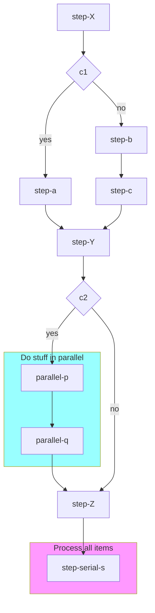

# SampleWorkflow.ts

```mermaid
flowchart TD
  node0[step-X]
  node1{c1}
  node2[step-a]
  node1 --> |yes| node2
  node3[step-b]
  node4[step-c]
  node3 --> node4
  node1 --> |no| node3
  node0 --> node1
  node5[step-Y]
  node2 --> node5
  node4 --> node5
  node6{c2}
  subgraph node7 [Do stuff in parallel]
    node8[parallel-p]
    node9[parallel-q]
    node8 --> node9
  end
  class node7 parallel
  node6 --> |yes| node8
  node5 --> node6
  node10[step-Z]
  node9 --> node10
  node6 --> |no| node10
  subgraph node11 [Process all items]
    node12[step-serial-s]
  end
  class node11 loop
  node10 --> node12
  classDef loop fill:#f9f
  classDef parallel fill:#9ff
```
